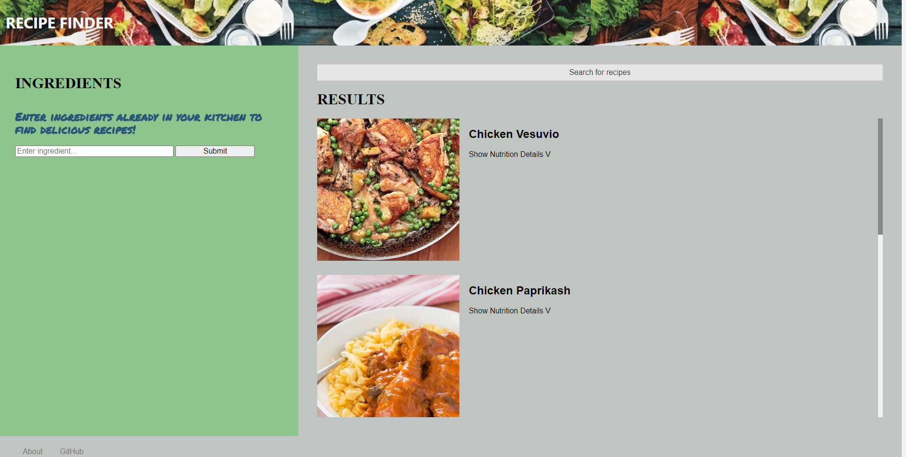

# Recipe Finder

[Github repo](https://github.com/ampatte/recipe-finder-app)

​[Deployed app](https://ampatte.github.io/recipe-finder-app)

 ## Description
 Recipe Finder

 Recipe Finder is an application that allows users to input a list of ingredients and outputs a list of recipes with those ingredients. Recipe Finder also allows the user to get all nutritional information for each recipe returned.

 ## Table of Contents
  - [Installation Instructions](#Installation)
  - [Usage Information](#Usage)
  - [Contribution Guidelines](#Contribution)
  - [Test Instructions](#Test)
  - [Questions](#Questions)
  - [License](#License)

 ## Installation
 There are no installation requirements. The url can be run in any web browser.

 ## Usage
 Recipe Finder was built for many types of users. The user will easily be able to go through their own stock of ingredients, or ingredients they like, to get a wide variety of recipes. This is useful for those looking to save time and money to make delicious recipes by using the things they have, or for users looking to get creative in their cooking by searching with thier chosen ingredients. 

 Acceptance Criteria
 - It is done when the user can input a list of chosen ingredients into the ingredient box and have them displayed in a list.
 - It is done when the user can select the ingredients from their list for use in the recipes or delete them if desired.
 - It is done when the user submits the selected ingredients and a list of recipes with those ingredients is returned.
 - It is done when the user can access the nutritional information for each recipe.

 
​
 ## Contribution
 Recipe Finder was created by Anna, Dre, James and Brigitte in December 2022.​

 ​APIs & Technologies Used:​
 - Edamam Nutrition API https://developer.edamam.com/edamam-docs-nutrition-api
 - Edamam Recipe API https://developer.edamam.com/edamam-recipe-api ​
 - PureCSS.io​
 - Google Fonts

 Breakdown of tasks and roles
 - Bridget – HTML, READme & Presentation, Wireframe​
 - Anna - CSS, HTML, Presentation​
 - James - JavaScript, HTML​
 - Dre - CSS, JavaScript, HTML,​

 Developer Issues
 - Determining how to split up the project​
 - Figuring how to connect the ingredients with the checkboxes​
 - Learning new CSS frameworks from Tailwind, to Pure, Bulma, and back to Pure.  We were able to find a layout we liked but had responsiveness issues​

 Goals for Future Development
 - The user can scroll through recipes and select favorites to save to their device to access whenever they desire.

 [Original Project Repo​](https://github.com/dredawkins11/recipe-finder-app​)

 ## Test
 Enter ingredients into the input bar and press submit to test the functionality.

 ## Questions?
  - Github link: https://github.com/ampatte
  - Email link: ampatte717@gmail.com

 ## License
 This project is covered under the MIT license.(https://choosealicense.com/licenses/mit/)